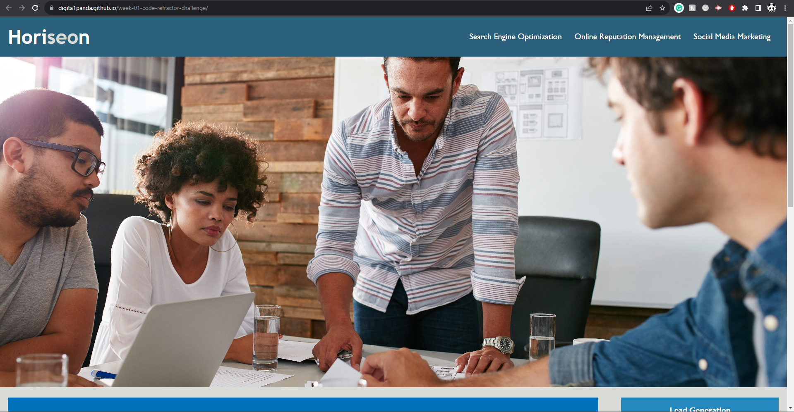

# Week 01 Horiseon code refractor challenge

## Description 

- This is my first challenge of bootcamp front end web developement. I have taken a big leap and decided to learn coding. I have been motivated by the nice design and UX that is out there.
- I am to refractor the code and in accordance to the "scouts rule" to clean up the code to HTML and the CSS stylesheet.
- I have tackled this challenge in order to make the website more accessible to people who uses screen reader, so it is accessible to people with disability.
- I have done this by using semantics in the HTML file and using "alt" for image tags.
- I have learned a great deal from padding to display properties and how the webpage is setup.

[github page](https://digita1panda.github.io/week-01-code-refractor-challenge/)

## Installation

N/A

## Usage 

## Credits

N/A

## License

MIT License

---

## Badges

## Features

N/A

## Contributing

https://www.w3schools.com/tags/tag_abbr.asp
https://www.w3schools.com/tags/default.asp 

## Tests

N/A

---

© 2023 edX Boot Camps LLC. Confidential and Proprietary. All Rights Reserved.
